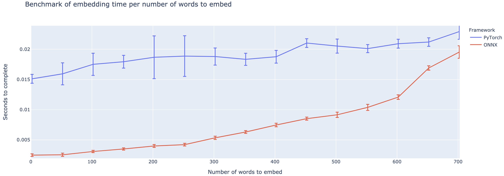
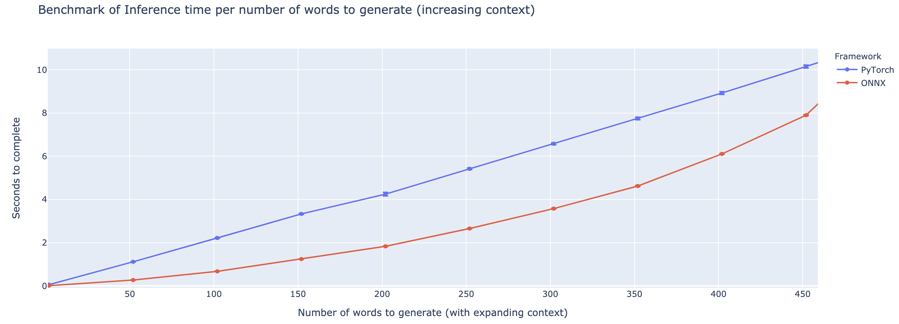

# ONNX-T5
[](https://github.com/abelriboulot/onnxt5/actions)

T5 Implementation in ONNX with utility functions for fast inference. This package is still in alpha
stage, therefore some functionalities such as beam searches are still in development.

## Installation
```bash
git clone https://github.com/abelriboulot/onnxt5
cd onnxt5
pip install -e .
```

## Usage
The simplest way to get started for generation is to use the default pre-trained
version of T5 on ONNX included in the package
```python
from onnxt5 import GenerativeT5
from onnxt5.api import get_encoder_decoder_tokenizer
decoder_sess, encoder_sess, tokenizer = get_encoder_decoder_tokenizer()
generative_t5 = GenerativeT5(encoder_sess, decoder_sess, tokenizer, onnx=True)
prompt = 'translate English to French: I was a victim of a series of accidents.'

output_text, output_logits = generative_t5('translate English to French: I was a victim of a series of accidents.', 21, temperature=0.)
# output_text: "Je suis victime d'une série d'accidents."
```

If you want to get the embeddings of text, you can run the following
```python
from onnxt5.api import get_encoder_decoder_tokenizer, run_embeddings_text

decoder_sess, encoder_sess, tokenizer = get_encoder_decoder_tokenizer()
prompt = 'Listen, Billy Pilgrim has come unstuck in time.'
encoder_embeddings, decoder_embeddings = run_embeddings_text(encoder_sess, decoder_sess, tokenizer, prompt)
```

ONNXT5 also lets you export and use your own models. See the `examples\` folder for more detailed examples.

T5 works with tokens such as `summarize:`, `translate English to German:`, or `question: ... context:`. You can see a 
list of the pretrained tasks and token in the [original paper](https://arxiv.org/pdf/1910.10683.pdf).

## Functionalities
* Run any of the T5 trained tasks in a line (translation, summarization, sentiment analysis, completion, generation)
* Export your own T5 models to ONNX easily
* Utility functions to generate what you need quickly
* Up to 4X speedup compared to PyTorch execution for smaller contexts

## Benchmarks
The outperformance varies heavily based on the length of the context. For contexts less than ~500 words,
ONNX outperforms greatly, going up to a 4X speedup compared to PyTorch. However, the longer the context, the smaller the 
speedup of ONNX, with Pytorch being faster above 500 words.

#### GPU Benchmark, Embedding Task


#### GPU Benchmark, Generation Task



## Acknowledgements
This repo is based on the work of Colin Raffel and Noam Shazeer and Adam Roberts and Katherine Lee and Sharan Narang and 
Michael Matena and Yanqi Zhou and Wei Li and Peter J. Liu from Google, as well as the implementation of T5 from the 
huggingface team, and the work of Thomas Wolf on generation of text.

[Original T5 Paper](https://arxiv.org/pdf/1910.10683.pdf)
```
@article{2019t5,
  author = {Colin Raffel and Noam Shazeer and Adam Roberts and Katherine Lee and Sharan Narang and Michael Matena and Yanqi Zhou and Wei Li and Peter J. Liu},
  title = {Exploring the Limits of Transfer Learning with a Unified Text-to-Text Transformer},
  journal = {arXiv e-prints},
  year = {2019},
  archivePrefix = {arXiv},
  eprint = {1910.10683},
}
```

[HuggingFace implementation of T5](https://huggingface.co/transformers/model_doc/t5.html)